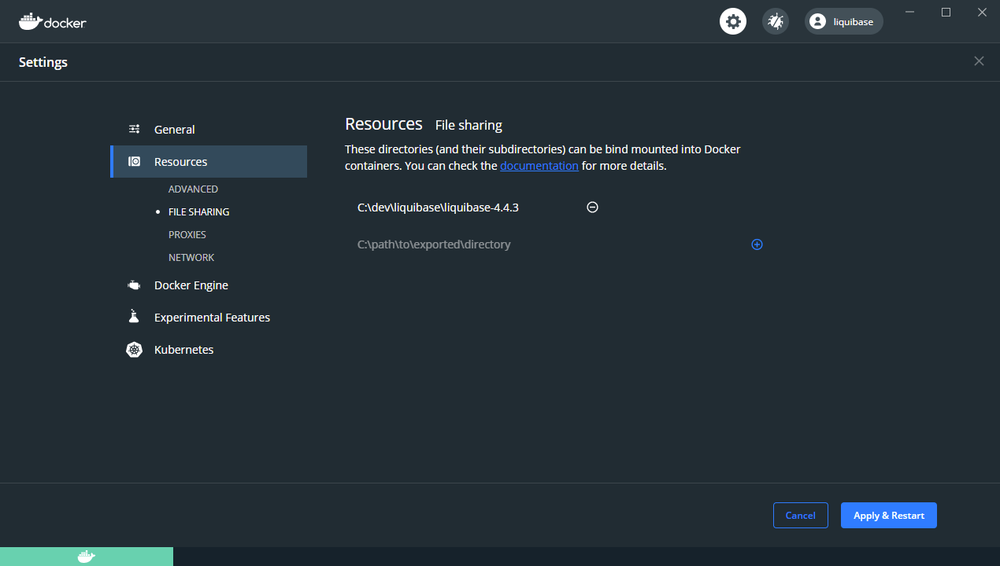

# Session 3: Extended Liquibase Diffs

Over the next hour, you will build on your experience from Session 1 and Session 2. Session 3 focuses on finding the differences between two database commits. This allows you to easily create Liquibase changelogs based on chances to accelerate CI/CD for the database.

> For assistance, questions, or comments, please contact us via [Discord.](https://discord.gg/NVpqM7nNnT)

> After completing the Session, please provide feedback [here.](https://forms.gle/T2thMj8Jm6KRiCb1A)

# Step 1: Tag Database Changes

Tags help you assign human-friendly names to specific commits. They can also be "floating tags" so that you are able to mark a commit as a "golden database" for standardized testing and development. Tags in Liquibase Data are strings with no spaces. Multiple tags (e.g., -t foo -t bar) are acceptable. Tags are applied to a previously applied commit.

To create a tag, identify your last commit id with the following:

    liquibase data log

Once you have the commit id, apply a tag with the following command:

    liquibase data tag --commit=<commit id> --tags=<tag name>

Now that you have applied the new tag, you can checkout a specific commit using a tag.

    liquibase data checkout --tags=<tag name>

Note: If 2 commits have the same tag, Liquibase Data will check out the most recent commit.

# Step 2: Liquibase Data Diff

With Liquibase, you can create a difference report using the `diff` command. Normally, Liquibase requires two running databases. Liquibase Data handles that for you.

The Liquibase Data `diff` command requires two arguments: the `source-db` and the `target-state`. This assumes you will use the current state as your `source-target`. You can use the `source-target` argument to use a different source state than the current one.

NOTE: Windows users need to update Docker settings to take advantage of Liquibase Data diff functionality. Simple update Settings -> Resources -> File Sharing and include the directory you will execute `liquibase data` from. 

First, identify the current commit ID's using the following command:

    liquibase data log

Select the commit id that you want to compare against the current state and execute the following command:

    liquibase data diff --source-db=myrepos --target-state=<target-commit-id> --reference-url=<JDBC URL for source database>

The Reference URL can be found in your `liquibase.properties` file.

Now select a different commit ID and run the following command: 

    liquibase data diff --source-db=myrepos --source-state=<source-commit-id> --target-state=<target-commit-id> 

NOTE: Liquibase Data uses the term "source" to represent the database that holds the changes you with to apply to the "target". The terms "reference" and "source" are interchangeable.
    
## Step 3: Provide feedback on your experience.

Visit [here](https://forms.gle/T2thMj8Jm6KRiCb1A) to provide feedback.

You can also find us on [Discord](https://discord.gg/NVpqM7nNnT) in #beta-release or DM Robert Reeves (r2liquibase#9789) to schedule time to discuss your experience.